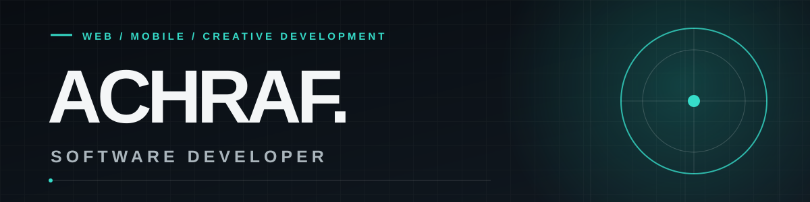

### I make digital experiences feel as good as they work.

Independent software developer based in Nador, Morocco. I build web and mobile experiences where thoughtful design meets reliable engineering — from the first interaction to the systems behind it.

**[Portfolio ↗](https://achraf-mouhssin.vercel.app/)** · [LinkedIn](https://www.linkedin.com/in/achraf-mouhssin-3a661342a/) · [Email](mailto:mouhsinachraf@gmail.com)

---

### Selected work

| Project | The idea | Explore |
| :--- | :--- | :--- |
| **Yuki's Café** | An editorial café experience with animated menu discovery and smooth, tactile interactions. | [Live site](https://yuki-s-six.vercel.app/) · [Code](https://github.com/Achraaaff/Yuki-s) |
| **Stagiaire** | A full-stack internship platform connecting local students and companies through listings, applications, and direct messages. | [Live site](https://stagiaire-zeta.vercel.app/) · [Code](https://github.com/Achraaaff/Stagiaire) |
| **وِرد · Wird** | An Arabic-first daily dhikr app with offline use, progress tracking, sync, and a multilingual interface. | [Live app](https://wird-islamic.vercel.app/) · [Code](https://github.com/Achraaaff/Wird) |

### What I bring to a project

- **Frontend & interaction:** TypeScript, React, Next.js, GSAP
- **Backend & data:** Node.js, NestJS, Prisma, Supabase
- **Approach:** design-aware, full-stack, focused on the details people notice

Computer Science & AI graduate · Web & Mobile Application Development background.

**Have a project in mind?** [Let's talk ↗](mailto:mouhsinachraf@gmail.com)
